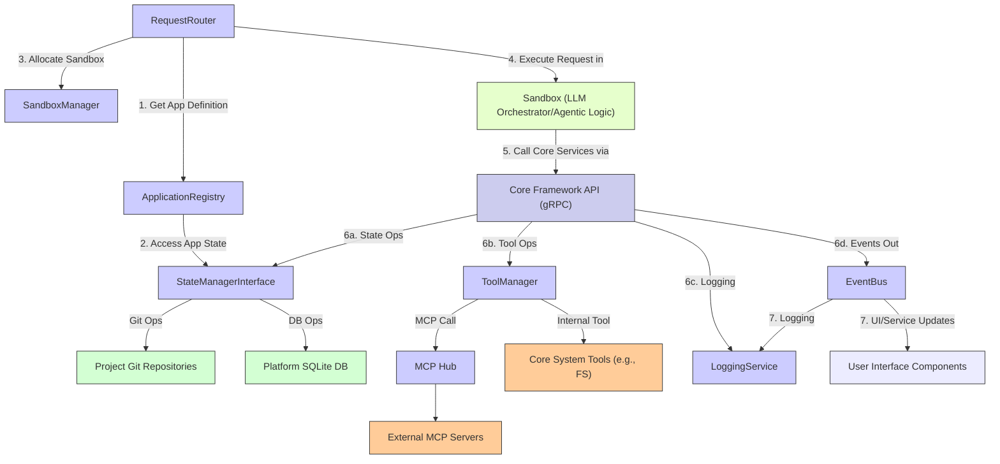

### 2.1 Detailed Architecture (MVP Focus)

This diagram details the interactions between the primary backend services of the Core Framework.

## 6. Technical Backend (MVP Core Components – Lean Implementation)

The backend architecture is designed to be API-driven, ensuring a clean separation of concerns and facilitating future scalability and client diversity.

### 6.1 API-Driven Architecture – Foundation for Flexibility
All frontend UI actions (from the chat window, canvas interactions, toolbar clicks) must communicate with a well-defined backend API. This ensures a clean separation of concerns between the frontend and backend logic, facilitates easier testing, and allows for the future development of alternative clients (e.g., a more advanced CLI, mobile apps, or third-party integrations) that can consume the same backend services. For the POC, a RESTful HTTP API or a simple RPC-style API (like gRPC if the team is comfortable) would be suitable. Key API endpoints would be needed for user authentication, project creation/management, app execution control, chat interaction with Nexus, and canvas content operations.

### 6.2 Core Framework (Simplified for POC – Essential Services)
The backend will be built around a Core Framework providing essential services. For the MVP, these components should be implemented in a lean, functional manner:

*   **Application Registry (Minimal)**: Its primary role in the POC is to manage a basic `AppDefinition` for each project. This `AppDefinition` (likely a YAML file in the project's Git repo, see Section 4.7) must at least contain: the app's unique name (and an internal `appId` generated by the system), its core prompt(s) or a reference to a very simple predefined workflow that defines its behavior, the chosen LLM (e.g., model identifier like "openai/gpt-4o-mini"), and the AI-defined start script command/path necessary for execution. Refer to Section 3.1 for more details.
*   **Sandbox Manager (Docker Focus)**: This component is critical for running the user's apps in isolated environments. For the MVP, it must be able to:
    *   Start Docker containers based on a generic base image. This base image should be pre-configured with necessary runtimes (e.g., Python 3.10+, Node.js LTS) and common libraries that Nexus might use or generate code for.
    *   Reliably stop and restart these containers on demand.
    *   Execute the AI-defined operational scripts (like the "start" script from the `AppDefinition`) within the running containers. This could be achieved using `docker exec` or by having a minimal agent/API endpoint within the base Docker image that the `SandboxManager` can call. Refer to Section 3.2 for more details.
*   **Request Router (Minimal)**: This component acts as the initial entry point for many backend requests. For the MVP, it needs to intelligently route incoming user requests from the UI (originating from chat commands, toolbar actions, etc.) to either:
    1.  The correct app's running sandbox if the request is intended for an active application (e.g., user input for a running chat app).
    2.  Nexus's core logic if it's a platform-level command (e.g., "create a new project") or a general request for assistance from Nexus as the AI assistant.
    The routing logic could be based on URL paths, specific headers, or parameters in the request payload. Refer to Section 3.4 for more details.
*   **StateManagerInterface (Git-based)**: This service is the sole gateway for interacting with project storage. For the MVP, it must be able to manage project files within **local Git repositories** on the server. Its capabilities must include: reading file contents, writing/updating files (and ensuring these changes are committed to Git with appropriate messages), and retrieving file version history to support the rollback feature. It abstracts the direct Git commands from other parts of the system. Refer to Section 3.3 for more details.

### 6.3 Prompts – Foundation from ClineAGI – Strategic Reuse
A significant accelerator for developing Nexus's intelligence and conversational capabilities for the MVP is to leverage and adapt the extensive, detailed prompts that were developed for the prior ClineAGI project. This existing body of work (including `.clinerules` concepts if adaptable) can form the initial basis for:
*   Nexus's core conversational intelligence and natural language understanding.
*   Its ability to guide users through various tasks (like app creation or configuration).
*   The underlying logic for many of the agentic tasks the platform will perform.
The `prompt_inventory.yaml` and the LLM Prompt Template YAML format, as described in Section 3.18.1 Agent Definition & Prompting, should be utilized to organize, manage, and deploy these adapted prompts effectively. [cite: ProAGI/memory-bank/web-research.md, spec_sections/03.18.1_AgentDefinitionPrompting.md]

### 6.4 Open Source Leverage – Build Smart, Not Hard – Explicit Instruction to Dev AI
The AI responsible for building the POC software should be explicitly instructed and strongly encouraged to utilize existing, mature, and well-maintained open-source libraries for common, non-core functionalities. Reinventing the wheel for standard components is counterproductive for an MVP and can introduce unnecessary bugs and delays. This includes, but is not limited to:
*   **Docker Interaction**: Libraries like `docker-py` for Python or equivalent robust libraries in other languages (e.g., Node.js `dockerode`).
*   **Git Repository Management**: Libraries like `GitPython` for Python or `simple-git` for Node.js to handle Git operations programmatically.
*   **Backend Web Framework**: A lightweight but capable web framework for building the API server (e.g., FastAPI or Flask for Python; Express.js for Node.js).
*   **Frontend Framework/Libraries (Optional for POC UI)**: While a very simple UI for the chat and canvas might be achievable with vanilla JavaScript, HTML, and CSS for the POC, if a minimal framework simplifies development (e.g., Svelte, Vue.js for specific components), its use should be considered. The goal is functionality and speed for the MVP.
*   **Basic Data Handling**: Libraries for JSON/YAML parsing and serialization are standard.
