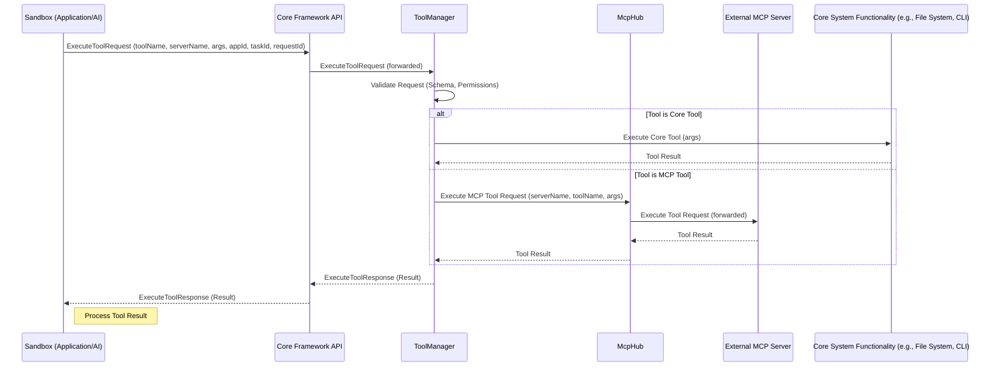

### 3.11 Tool Execution Workflow

**Purpose:** This section describes the workflow for how a tool call, initiated by application logic or AI running within a Sandbox, is processed and executed by the core Nexus CoCreate AI system.

**Flow Description:**

When an application or AI within a Sandbox needs to perform an action that requires a tool (e.g., reading a file, executing a command, using an MCP tool), it initiates a tool execution request via the `Core Framework API`. This request is then routed through the core system components to identify and execute the appropriate tool, and the result is returned back to the originating Sandbox.

**Conceptual Workflow:**

**Key Steps and Component Responsibilities:**

1.  **Initiation (Sandbox):** The application or AI within a Sandbox determines the need to execute a tool and sends an `ExecuteToolRequest` to the `Core Framework API`, including the tool name, server name (if applicable), arguments, and relevant context IDs (`appId`, `taskId`, `requestId`).
2.  **Request Forwarding (Core Framework API):** The `Core Framework API` receives the request from the Sandbox and forwards it to the `ToolManager`.
3.  **Validation (ToolManager):** The `ToolManager` validates the incoming request. This includes checking if the tool exists, if the arguments match the tool's input schema, and if the requesting application (`appId`) has the necessary permissions to execute this tool (potentially checking with the `ApplicationRegistry` or `StateManagerInterface`).
4.  **Tool Identification & Routing (ToolManager):** Based on the `toolName` and `serverName`, the `ToolManager` identifies whether it's a core tool or an MCP tool.
5.  **Core Tool Execution (ToolManager -> Core System Functionality):** If it's a core tool (e.g., file read/write, CLI execution), the `ToolManager` executes the corresponding core system functionality, passing the arguments. The result is returned to the `ToolManager`.
6.  **MCP Tool Routing (ToolManager -> McpHub):** If it's an MCP tool, the `ToolManager` forwards the execution request to the `McpHub`, specifying the target `serverName` and `toolName`.
7.  **MCP Tool Execution (McpHub -> External MCP Server):** The `McpHub` routes the request to the appropriate external MCP server. The MCP server executes the tool and returns the result to the `McpHub`.
8.  **Result Return (McpHub -> ToolManager):** The `McpHub` returns the tool result back to the `ToolManager`.
9.  **Response Return (ToolManager -> Core Framework API):** The `ToolManager` packages the result into an `ExecuteToolResponse` and sends it back to the `Core Framework API`.
10. **Final Delivery (Core Framework API -> Sandbox):** The `Core Framework API` returns the `ExecuteToolResponse` to the originating Sandbox.
11. **Result Processing (Sandbox):** The application or AI within the Sandbox receives the tool execution result and continues its logic based on the outcome.

This workflow ensures that all tool interactions are mediated by the core framework, allowing for centralized validation, permission enforcement, and monitoring.
