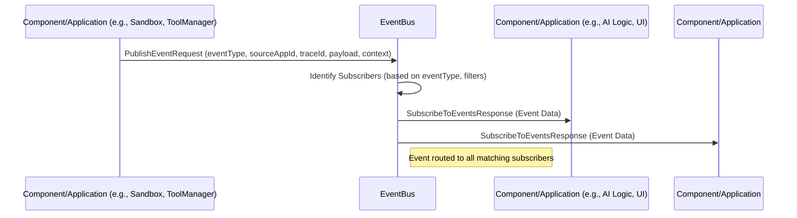

### 3.12 Event Processing Workflow

**Purpose:** This section describes the workflow for how events, published by various components within the Nexus CoCreate AI system, are processed and distributed to interested subscribers via the `EventBus`.

**Flow Description:**

Components and applications within the Nexus CoCreate AI system can publish events to the `EventBus` to signal changes in state, completion of actions, or other occurrences. The `EventBus` then routes these events to any components or applications that have subscribed to receive them, enabling asynchronous communication and reaction to system activity.

**Conceptual Workflow:**

**Key Steps and Component Responsibilities:**

1.  **Event Publication (Publisher):** A component or application (e.g., a Sandbox after executing a workflow, the `ToolManager` after a tool call, the `StateManagerInterface` after a state change) determines the need to publish an event. It sends a `PublishEventRequest` to the `EventBus`, including the event type, source, payload data, and relevant context.
2.  **Subscriber Identification (EventBus):** The `EventBus` receives the published event and consults its internal registry of subscriptions. It identifies all components or applications that have subscribed to this specific `eventType` and match any relevant filters (e.g., source application ID, context criteria).
3.  **Event Distribution (EventBus -> Subscribers):** The `EventBus` routes the event data to each identified subscriber. This is typically done via a server-side streaming connection established when the subscriber initially called `SubscribeToEvents`.
4.  **Event Processing (Subscribers):** Components or applications that receive the event process the event data and react accordingly. This might involve updating internal state, triggering further actions, updating a user interface, or logging the event.

This workflow ensures that components can react to system activity in a decoupled manner, promoting modularity and responsiveness.
