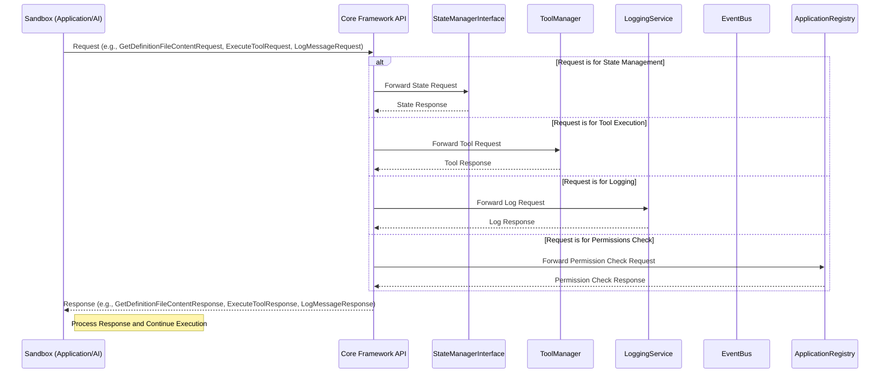

### 3.13 Core Framework API Workflow

**Purpose:** This section describes the workflow for how applications and AI logic running within a Sandbox interact with the core Nexus CoCreate AI system by making requests to the `Core Framework API`.

**Flow Description:**

Applications and AI within Sandboxes are isolated from the core system and external resources. To perform actions like accessing persistent state, executing tools, or logging, they must make requests to the `Core Framework API`. This API acts as a secure gateway, mediating all interactions between the Sandbox environment and the core system components.

**Conceptual Workflow:**

**Key Steps and Component Responsibilities:**

1.  **Initiation (Sandbox):** The application or AI within a Sandbox determines the need to interact with the core system. It constructs the appropriate request message (e.g., `GetDefinitionFileContentRequest`, `ExecuteToolRequest`, `LogMessageRequest`) and sends it to the `Core Framework API`.
2.  **Request Routing (Core Framework API):** The `Core Framework API` receives the request from the Sandbox. Based on the type of request (e.g., state management, tool execution, logging, permissions check), it routes the request to the appropriate core system component (`StateManagerInterface`, `ToolManager`, `LoggingService`, `ApplicationRegistry`).
3.  **Request Processing (Core Components):** The targeted core component processes the request, performs the necessary action (e.g., reads a file from state, executes a tool, records a log message, checks a permission), and generates a response.
4.  **Response Return (Core Components -> Core Framework API):** The core component sends its response back to the `Core Framework API`.
5.  **Final Delivery (Core Framework API -> Sandbox):** The `Core Framework API` returns the response to the originating Sandbox.
6.  **Response Processing (Sandbox):** The application or AI within the Sandbox receives the response from the `Core Framework API` and continues its execution logic based on the outcome.

This workflow ensures that Sandboxes can securely and reliably access core system functionalities while maintaining their isolation.
