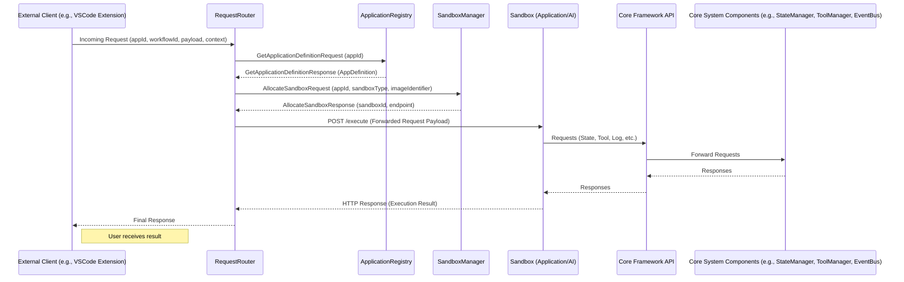

### 3.14 Request Processing Workflow

**Purpose:** This section describes the overall workflow for how an incoming request to the Nexus CoCreate AI system is processed, from its arrival at the `RequestRouter` to its execution within a Sandbox and the return of the response.

**Flow Description:**

An incoming request, typically from a client like the VSCode extension, represents a user's instruction or a system event that requires processing by a specific application or core functionality within Nexus CoCreate AI. The request processing workflow orchestrates the interaction between the core components to handle this request within an isolated Sandbox environment and deliver the result back to the client.

**Conceptual Workflow:**

**Key Steps and Component Responsibilities:**

The request processing workflow in Nexus CoCreate AI follows these steps:

1.  **Ingestion:** An incoming request (e.g., User HTTP request, internal trigger, webhook callback) arrives at the Core Framework's entry point (e.g., load balancer, ingress controller).
2.  **Initial Handling:** An initial component (e.g., `RequestIngestor`) performs basic validation, identifies the target `appId` (e.g., from hostname or API key validated via `ApplicationRegistry`), extracts source details, and forwards the processed event information to the `RequestRouter`.
3.  **Routing Decision:** The `RequestRouter` consults the `ApplicationRegistry` using the `appId` and event details (e.g., path, method) to find the corresponding `ComponentDefinition` in the application's state. This definition indicates the handler type (`LLM`, `JIT`, `WORKFLOW`), the required sandbox pool (`targetPoolName`), and specific task details (prompt, script/function, `workflowId`).
4.  **Sandbox Allocation:** The `RequestRouter` requests an available sandbox instance from the appropriate pool (`targetPoolName` for the specified `appId`) by calling the `SandboxManager.AllocateSandbox` API.
5.  **Context Assembly:** The `RequestRouter` gathers necessary context information, including user details (from Auth component), session ID, relevant configuration values (from `ApplicationRegistry`), the `mcp_endpoint` URL, and the specific `taskDetails` or `workflowInfo`.
6.  **Sandbox Execution Call:** The `RequestRouter` constructs the JSON payload for the `POST /execute` request (containing `requestData` and `context`) and sends it to the allocated Sandbox container's internal HTTP server address (provided by `SandboxManager`).
7.  **Sandbox Processing:** The Sandbox container receives the `/execute` request. Its internal server/runner executes the appropriate application logic (LLM interaction, JIT code, or workflow orchestration) based on the `handlerType` and `taskDetails` in the request. During processing, the sandbox can interact with state (`core.state.*`), configuration (`core.framework.getConfigValue`), tools (`core.linux.executeCommand`, `community.*`, `app.*`), etc., via calls to its designated Application-Specific MCP Server (`mcp_endpoint`).
8.  **Sandbox Response:** The Sandbox completes its processing (or a workflow step) and constructs a response JSON object, including `resultType`, `data` (the outcome), and optional `metrics`. It sends this back as the HTTP 200 OK response to the `/execute` call from the `RequestRouter`.
9.  **Response Handling:** The `RequestRouter` receives the response from the Sandbox. It forwards the `metrics` to the `MetricCollector`. It interprets the `resultType` and `data` based on the component's `expectedResultFormat` and the original request source.
10. **Final Response:** The `RequestRouter` (or a downstream component) sends the final formatted response back to the original requester.
11. **Sandbox Release:** (If explicit release is used) The `RequestRouter` notifies the `SandboxManager` that the instance is free (`ReleaseSandbox`).

This comprehensive workflow ensures that all requests are processed securely and reliably within isolated environments, leveraging the core system components for state, tools, and communication.
