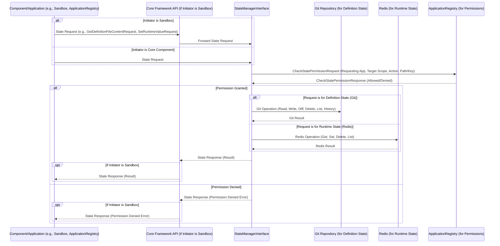

### 3.15 State Management Workflow

**Purpose:** This section describes the workflow for how components and applications within the Nexus CoCreate AI system access and manage persistent state (both versioned Definition/Config state and volatile Runtime state) via the `StateManagerInterface`.

**Flow Description:**

The `StateManagerInterface` provides a unified way for various components (including applications running in Sandboxes via the `Core Framework API`, and core services like the `ApplicationRegistry` or `McpHub`) to interact with the system's state. It abstracts the underlying storage mechanisms (Git for versioned state, Redis for runtime state), ensuring consistent access and enforcing permissions.

**Conceptual Workflow:**

**Key Steps and Component Responsibilities:**

1.  **Initiation (Initiator):** A component or application determines the need to access or modify state. If the initiator is running within a Sandbox, it sends the state request (e.g., `GetDefinitionFileContentRequest`, `SetRuntimeValueRequest`) to the `Core Framework API`. If the initiator is a core component, it calls the `StateManagerInterface` directly.
2.  **Request Forwarding (Core Framework API - if applicable):** If the request originated from a Sandbox, the `Core Framework API` forwards the state request to the `StateManagerInterface`.
3.  **Permission Check (StateManagerInterface -> ApplicationRegistry):** Before performing any state operation, the `StateManagerInterface` checks with the `ApplicationRegistry` (or an internal permission module) if the requesting application (`appId`) has the necessary permissions to perform the requested `action` (read, write, delete) on the `targetScope` (global, application-specific) and `pathOrKey`.
4.  **State Operation (StateManagerInterface -> Git/Redis):** If permission is granted, the `StateManagerInterface` performs the requested operation on the underlying storage system.
    *   For Definition/Config State requests (e.g., `GetDefinitionFileContent`, `SetDefinitionFileContent`, `ApplyDefinitionDiff`), it interacts with the Git repository.
    *   For Runtime State requests (e.g., `GetRuntimeValue`, `SetRuntimeValue`), it interacts with Redis.
    *   If permission is denied, the `StateManagerInterface` generates a permission denied error response.
5.  **Result Return (Git/Redis -> StateManagerInterface):** The result of the storage operation (data, success status, error) is returned to the `StateManagerInterface`.
6.  **Response Return (StateManagerInterface -> Core Framework API -> Initiator):** The `StateManagerInterface` packages the result into the appropriate state response message. If the request originated from a Sandbox, the response is sent back through the `Core Framework API`. Otherwise, it's returned directly to the core component that initiated the request.
7.  **Response Processing (Initiator):** The initiating component or application receives the state response and continues its logic based on the outcome (e.g., uses the retrieved data, handles a success/error status).

This workflow ensures that all state access is controlled, versioned (for definition state), and abstracted from the underlying storage technologies.
