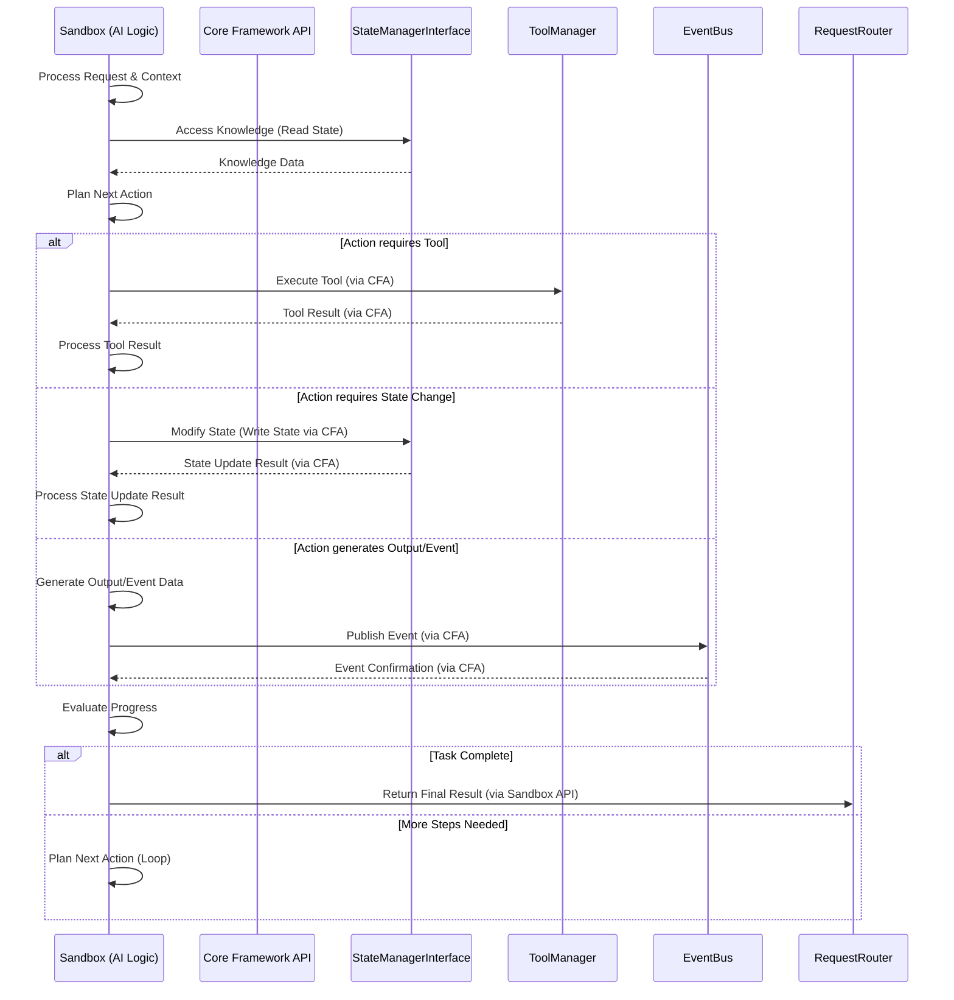

### 3.18 AI Logic

**Purpose:** The conceptual component representing the core AI capabilities and reasoning engine within the Nexus CoCreate AI system. This is where the AI processes information, makes decisions, plans actions, and generates responses, often running within a Sandbox environment.

**Transport Protocol:** Internal to the Sandbox environment. Interacts with the core system via the `Core Framework API`.

**Key Responsibilities:**
*   Receiving and interpreting requests and context forwarded from the `RequestRouter` (via the Sandbox API).
*   Accessing and utilizing knowledge from the `StateManagerInterface` (e.g., Memory Bank, `.clinerules`, prompts).
*   Planning and decomposing complex tasks into smaller steps.
*   Selecting and executing appropriate tools (core or MCP) via the `Core Framework API`.
*   Processing tool execution results and integrating them into the ongoing task.
*   Generating responses, code, documentation, or other outputs based on the task and context.
*   Learning from interactions and updating knowledge (conceptual - details like learning mechanisms are part of AGI development).
*   Handling errors and adapting strategies (conceptual - leveraging patterns like Adaptive Problem-Solving).
*   Maintaining awareness of its own state and limitations (conceptual - metacognition).

**Interaction Flow (Conceptual):**

**Relationship to other Components:**
*   Runs within a `Sandbox` instance.
*   Communicates exclusively with the core system via the `Core Framework API`.
*   Relies heavily on the `StateManagerInterface` for persistent knowledge and context.
*   Utilizes the `ToolManager` (via the `Core Framework API`) to interact with the environment and external services.
*   Publishes events to the `EventBus` (via the `Core Framework API`) to signal progress or outcomes.
*   Receives initial requests and returns final results via the `Sandbox API` (which communicates with the `RequestRouter`).
