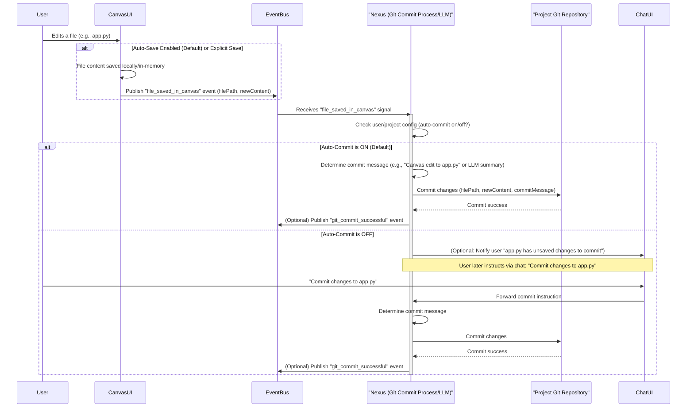

# 3.20 User Interface (UI)

## 3.20.1 Introduction

This section details the design principles and core components of the Nexus CoCreate AI user interface, focusing on the Minimum Viable Product (MVP) / Proof of Concept (POC) experience.

## 3.20.2 User Experience Goals

The paramount goal for the user experience (UX) is to be deeply intuitive, primarily chat-centric, and highly capable of abstracting underlying technical complexities. Users, regardless of their technical background, should feel as though they are collaborating with an intelligent, helpful partner (Nexus) rather than programming a complex machine.

*   **Chat-centricity:** The chat window is the primary medium for command, control, creation, and learning. It supports persistent context within a project.
*   **Abstraction of Complexity:** The interface hides technical details like package management or intricate API integrations, allowing users to focus on high-level goals.
*   **Adaptive Interface:** The interface should subtly adapt to the user's level of expertise, offering guided workflows for novices and exposing advanced options for power users.

## 3.20.3 MVP UI Components and Interactions

This section details the essential UI components and interaction paradigms for the Minimum Viable Product (MVP).

### 3.20.3.1 Primary Interface – The Nexus Chat Window

The cornerstone of user interaction is a persistent, context-aware chat window for natural language conversations with Nexus. Through this interface, users will:
*   Define and refine project goals and requirements.
*   Request Nexus to perform actions (create apps, generate code, summarize content, run projects).
*   Receive guidance, suggestions, and feedback from Nexus.
*   Troubleshoot issues and manage project settings.

For the MVP, text-based input is primary. The chat supports persistent context within a project.

### 3.20.3.2 The Canvas – A Dynamic Content Workspace

A versatile "canvas" area serves as the primary view for displaying and interacting with content generated by apps or Nexus. It adapts to the content type. For the MVP, the Canvas should function similarly to how modern LLM interfaces (e.g., Gemini, ChatGPT with code interpreter/plugins) allow users to view and interact with various file types. It's a "what you get is what you see editor" for data, code, text, and images. For the MVP/POC, this includes:
*   **Viewing**:
    *   Text documents (plain text, Markdown with preview).
    *   Source code (with basic syntax highlighting for common languages like Python, JavaScript, YAML, JSON). Features like code folding for JSON/YAML would enhance readability.
    *   Simple image formats (e.g., PNG, JPEG).
*   **Basic Edits**:
    *   **Text/Code**: Users should be able to make direct text edits within the canvas. For code, while a full IDE experience is out of scope for POC, basic syntax highlighting is essential. Nexus could potentially provide simple auto-completion hints or linting feedback conversationally if the user asks for a review of the code on the canvas.
    *   **Images (POC)**: Essential capability is viewing. Basic info (dimensions, name) is useful. Simple manipulations such as cropping to a selected area, perhaps basic color adjustments (e.g., brightness/contrast sliders if simple to implement), or markup/annotations (e.g., drawing simple arrows or text overlays to highlight parts of an image when providing feedback to Nexus) would be valuable. The ability to "Save As" a modified version of an image, or save the annotated image, would also be valuable. Editing is not core MVP beyond these simple manipulations.

The core principle of the canvas is to provide a visually rich, formatted representation of data, moving beyond plain text outputs, and allowing users to take manual control when needed. It's where the "work" of the app often becomes tangible. A key interaction pattern is for users to open a file (e.g., a Python script, a Markdown document) in the canvas and then, through a clearly identifiable button or a conversational command like "Nexus, look at this file," initiate a discussion with Nexus specifically about that content. Nexus should then be aware of the file being viewed, allowing the user to ask questions ("What does this function do?") or request modifications ("Change the title in this document to 'Q2 Report'"). The context of the active canvas item should be implicitly passed to Nexus.

### 3.20.3.3 Minimal Screens & Overlays

The UI is lean, avoiding a proliferation of complex screens. Most interactions flow through the chat and canvas. Contextual overlays may appear for specific, focused tasks (file version history, simple tool config pop-ups, confirmation dialogs). These are non-intrusive and quickly dismissible.

### 3.20.3.4 App Management Toolbar (POC Functionality)

When an app is selected or active, a simple, contextual toolbar provides essential buttons for core lifecycle actions:
*   **"Start":** Initiate execution of the app's defined start script in its Docker container.
*   **"Stop":** Terminate the running app container.
*   **"Restart":** Gracefully stop and then start the app container.

These actions provide clear visual feedback (status indicators, button changes, notifications).

### 3.20.3.5 Running App Interaction – Modality-Driven Presentation

Interaction with a "running" app depends on its nature:
*   **Conversational/Agentic Apps:** Run using the same agentic chat interface as Nexus, but operating strictly based on the app's defined logic. Clear visual cues indicate interaction with the app persona vs. the general Nexus assistant.
*   **Web-based Apps (POC Simplification):** Displayed via an embedded view (e.g., iframe) or by opening in a new browser tab. The AppDefinition may specify the preferred display method.
*   **CLI-based Apps (POC Simplification):** Interact via a basic "dummy shell" or text-based terminal-like interface within the app's container view on the canvas.

### 3.20.3.6 Switching Context Between App and Nexus

Users need a clear way to switch focus:
*   **Embedded Apps:** Nexus chat and project toolbar remain visible alongside the embedded app view.
*   **Separate Tab/Window Apps:** Standard browser tab switching returns to the main platform tab, which acts as the control panel for the project. A "Return to Project Management" button may be provided.

### 3.20.3.7 Canvas Editing & Version Control Workflow

This section details how edits made by the user in the Canvas are saved and versioned using Git, based on refinement point #11.

*   **Saving Mechanism:**
    *   **Auto-save** is the default behavior when editing files in the Canvas. Changes are saved locally/in-memory as the user types or shortly thereafter.
    *   Users can configure their settings to disable auto-save and opt for an **explicit save action** (e.g., a save button in the Canvas toolbar or a keyboard shortcut like Ctrl+S/Cmd+S).
*   **Git Interaction & Commit Process:**
    *   When a file is saved in the Canvas (either by auto-save or explicit save), an `file_saved_in_canvas` event is published via the Event Bus. This event includes the file path and the new content.
    *   Nexus (the AI assistant) listens for this event.
    *   **Auto-Commit (Default):** By default, upon receiving the `file_saved_in_canvas` event, Nexus will automatically commit the changes to the project's local Git repository. Nexus will determine an appropriate commit message (e.g., "Canvas edit to [filename]" or a more descriptive summary if it can infer the nature of the changes).
    *   **User-Configurable Auto-Commit:** Users can configure their project or global settings so that Canvas saves do *not* automatically trigger Git commits.
    *   **Manual Commit:** If auto-commit is disabled, Nexus might notify the user (e.g., via chat) that the file has unsaved changes in the Git staging area. The user would then need to instruct Nexus via chat to commit the changes (e.g., "Nexus, commit the changes to app.py"). Nexus would then proceed with determining a commit message and committing.
    *   The `StateManagerInterface` handles the actual Git operations.

The following diagram illustrates this workflow:

### 3.20.3.8 Discoverability of Project Commands

This section details how users discover available project-specific commands (e.g., `@projects/my-project/cmd/run-tests.md`).

*   **Contextual Auto-Suggestion (Advanced Mode):**
    *   For users operating in a more "advanced mode," Nexus can proactively suggest relevant `@<project_command>.md` shortcuts directly in the chat based on the conversation's context or the user's current actions.
*   **Far Right Panel Listing (Basic Mode / General Discovery):**
    *   For "basic users," or as a general discoverability feature, available project-specific commands will be listed in the "Far Right Panel."
    *   This panel, which can be auto-hidden or pinned by the user, also serves to display project files, other contextual tools, and LLM-customizable buttons/shortcuts.

### 3.20.3.9 Minimum Viable Chat UI Feedback (POC)

This section defines essential feedback mechanisms in the chat UI for the Proof of Concept (POC). Nexus has an interface/logic to decide what it communicates to the user, and this communication is tunable by the user (via settings for communication style and detail level).

*   **Long-running operations:**
    *   The chat UI should display a "thinking" or "processing" indicator (similar to Gemini's visual cue) while Nexus is working on tasks in the background.
    *   The level of explicit text updates (e.g., "Building Docker image...") will depend on the user's configured detail preference. The default should be minimal text updates, relying more on the visual "thinking" indicator.
*   **Successful completion of a command/task:**
    *   Nexus will provide a confirmation. The verbosity and style will depend on user settings. For most users, a simple "Done!" or "Okay, I've completed that for you" is sufficient. The main feedback is the appearance of the result (e.g., new files in the Canvas, a running app).
*   **Errors encountered (after failed self-correction):**
    *   As per error handling clarifications (Section 4 of `Nexus_CoCreate_AI_updated_notes.md`), Nexus will communicate this in a user-friendly way, explaining it's trying a different high-level approach, rather than showing technical errors to the average user. The phrasing will be tuned by user preference.
*   **Power User / Detailed Mode:**
    *   Users who opt for a more detailed mode will see more explicit step-by-step feedback, including potentially abstracted versions of tools being used or decisions being made by Nexus.

## 3.20.4 UI Generation for Applications

A key aspect of the Nexus CoCreate AI platform is the dynamic generation of user interfaces for deployed applications.

*   **Generation Mechanism:** For V1, the primary mechanism involves an LLM (either the main application LLM handler or a specialized UI-focused LLM invoked via an MCP tool or workflow step). Based on the application's `ApplicationDefinition`, `ComponentRegistry`, user requirements specified during bootstrapping, and potentially the context of the current request, the LLM generates standard web frontend code: HTML, CSS, and JavaScript.
*   **Simplicity Focus:** The initial focus is on generating functional, standard interfaces. Standard layouts, form elements, and basic interactivity driven by JavaScript making calls back to the application's backend endpoints (routed via the `RequestRouter`) are expected.
*   **State-Driven:** The UI structure and content should reflect the current state and capabilities defined in the `ComponentRegistry` and Workflow Definitions.
*   **Serving:** Generated static assets (HTML, CSS, JS files) or dynamically rendered HTML are served directly by the Nexus CoCreate AI Core Framework. The framework includes an integrated web server component.

## 3.20.5 Admin Panel

A functional Admin Panel is essential for managing the Nexus CoCreate AI platform and the applications it hosts.

### 3.20.5.1 Core Requirements (V1)

*   **Application Management:**
    *   UI for initiating the Application Bootstrap Process (creating new applications - see Section 3.16).
    *   Listing deployed applications with their status (via `ApplicationRegistryService.GetApplicationStatus`).
    *   Viewing application definitions (via `ApplicationRegistryService.GetApplicationDetails`).
    *   Triggering application updates (invoking `ApplicationRegistryService.UpdateApplication`).
    *   Activating/Deactivating or Deregistering applications (invoking `ApplicationRegistryService.DeregisterApplication`).
*   **Basic Monitoring:**
    *   Displaying key metrics from the `MetricCollector` (e.g., request counts, latency, error rates, LLM token usage per application).
*   **Optimization Control:**
    *   UI for viewing and configuring optimization rules (Global, Per-App, Per-Component) stored in `AppDefinition`.
    *   Displaying recommendations from the `OptimizationOracle`.
    *   Manually triggering JIT optimization for components.
*   **Configuration Management:**
    *   UI for managing global framework settings and potentially sensitive application configurations (e.g., API keys, with secure storage).
*   **State Viewing/Editing (Limited):**
    *   Potential for browsing or carefully editing YAML files in an application's definition state (via `StateManagerInterface`), primarily for debugging or advanced configuration.

The Admin Panel acts as the primary human interface for the platform's control plane, utilizing internal APIs like `ApplicationRegistryService`.
